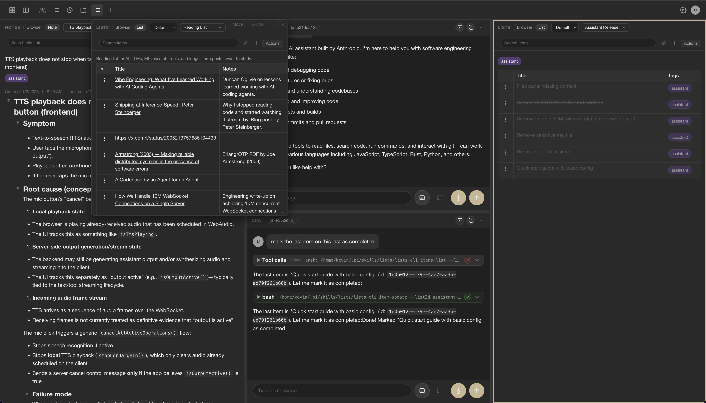
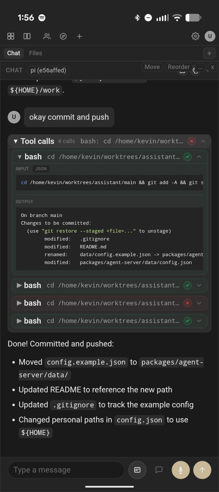

# assistant

A personal AI assistant with a panel-based plugin system, multi-agent CLI integrations, and text/voice UI.
Plugins define panels and operations so agents can collaborate on lists, notes, and diff reviews,
or extend the app with custom user-provided plugins.
OpenAI-compatible sessions are limited in functionality today and will likely be replaced
by an integration with the badlogic/pi-mono agent SDK.

<table>
  <tr>
    <td valign="top"></td>
    <td valign="top"></td>
  </tr>
</table>

## Table of Contents

- [Features](#features)
- [Quick Start](#quick-start)
- [Repository Layout](#repository-layout)
- [Documentation](#documentation)
- [External Integrations](#external-integrations)
- [Configuration](#configuration)
- [Development](#development)
- [Architecture](#architecture)
- [License](#license)

## Features

- **Text chat** with streaming responses
- **Voice input** using browser-based speech recognition (Web Speech API)
- **Voice output** via OpenAI TTS or ElevenLabs streaming TTS (optional)
- **CLI agent integrations** (Claude, Codex, Pi) alongside built-in providers
- **Scheduled sessions** for cron-driven CLI runs
- **Panel plugins** for lists, notes, diff review, and custom workflows
- **Tool integration** via MCP (Model Context Protocol) over stdio
- **Built-in session tools** – agent can list, search, create, switch, rename, and pin sessions
- **Persistent sessions** with JSONL event logs and optional naming/pinning
- **Multi-client support** – multiple browser windows can share a session
- **Theme + font preferences** (auto/light/dark + presets)

## Quick Start

```bash
# Clone the repository
git clone https://github.com/kcosr/assistant
cd assistant

# Install dependencies
npm install

# Build all packages
npm run build

# Build all packages in parallel
npm run build:parallel

# Build all packages in parallel on the remote builder
npm run build:remote

# Start the server (uses built-in config at packages/agent-server/data/config.json)
npm run start -w @assistant/agent-server

# Open http://localhost:3000 in your browser
```

The built-in config includes Claude Code, Codex, and Pi CLI agents. For a full configuration example with all options, see `packages/agent-server/data/config.example.json`.

### Configuration Overrides

Override the default paths using environment variables:

```bash
# Use a custom data directory (sessions, events, config)
export DATA_DIR=/path/to/data

# Use a specific config file
export APP_CONFIG_PATH=/path/to/config.json

npm run start -w @assistant/agent-server
```

The server looks for config at `${DATA_DIR}/config.json` by default, or at `APP_CONFIG_PATH` if set.

### Building Skills for CLI Agents

Plugins can be exported as skills for use with CLI agents that support skills (e.g., Claude Code, Codex, Pi):

```bash
# Build all plugin skills to a directory
npm run build:plugins -- --skills-dir /tmp/skills

# Copy specific skills to your agent's skills directory
# Claude: ~/.claude/skills/  |  Pi: ~/.pi/skills/  |  Codex: ~/.codex/skills/
cp -r /tmp/skills/{notes,lists} ~/.pi/skills/

# Or copy all skills (ensure no name conflicts with existing skills)
cp -r /tmp/skills/* ~/.pi/skills/

# Build only specific skills directly to the skills directory
npm run build:plugins -- --skills notes,lists --skills-dir ~/.pi/skills/
```

Some skills include a CLI binary. Add the skill directories to your PATH, or reference CLIs by full path in your AGENTS.md:

```bash
# Option 1: Add to PATH (in ~/.bashrc or ~/.zshrc)
export PATH="$PATH:$HOME/.pi/skills/notes:$HOME/.pi/skills/lists"

# Option 2: Reference full paths in AGENTS.md / SKILL.md documentation
```

### Keyboard Shortcuts

| Shortcut | Action |
|----------|--------|
| `Ctrl/Cmd + K` | Open command palette |
| `Ctrl/Cmd + ]` / `Ctrl/Cmd + [` | Cycle focus between panels |
| `Ctrl + P` | Toggle layout navigation mode |
| `Ctrl + H` | Toggle header panel navigation mode |
| `Ctrl + Shift + S` | Split active panel (placement mode) |
| `Ctrl + I` | Toggle text input focus |
| `Ctrl + A/C/D/F/L/N/S/T` | Focus last-used artifacts/chat/diff/files/lists/notes/sessions/time tracker (opens modal if none) |
| `Ctrl + R` | Toggle speech recording (if available) |
| `Cmd + Shift + S` (macOS) | Toggle sessions sidebar |
| `Cmd/Ctrl + Shift + C` | Toggle chat panel |
| `Cmd/Ctrl + Shift + ↑/↓` | Jump to top/bottom of chat |
| `Ctrl + Shift + Cmd + W` (macOS) / `Ctrl + Shift + Alt + W` (others) | Close panel (replace with placeholder) |
| `Ctrl + Shift + Cmd + X` (macOS) / `Ctrl + Shift + Alt + X` (others) | Remove panel from layout |
| `Shift + Enter` | Submit modal form (e.g., from tags input in notes/lists) |
| `Cmd + Click` (macOS) / `Ctrl + Click` (others) | Focus a non-chat panel (chat panels focus on regular click) |
| `Tab` / `Shift + Tab` | Cycle focus between sidebar and input (when input is empty) |
| `Esc` | Cancel active operations (on mobile, closes sidebar if open; in pinned or modal chat panels, closes the panel instead) |

In layout navigation mode: arrows move between panels, `Enter` selects, `Esc` exits, `Tab` cycles tabs, `m` toggles split view, `1-9` select visible panels, `0` cycles pages.

In header navigation mode: `←/→` (or `A/D`) cycle header panels, `Enter`/`↓` activates, `Esc` exits, `1-9` select visible panels, `0` cycles pages.

In split placement mode: arrows or WASD choose region, `Enter` confirms, `Esc` cancels.

**Sessions sidebar (when focused):**
- `Arrow Up/Down` – Move between sessions (selection follows focus)
- `Enter` – Focus input
- `t` – Toggle pin
- `d` / `Delete` / `Backspace` – Delete session (with confirmation)
- `c` – Clear history (with confirmation)

**Lists panel item selection:**
- `Click` – Select item (when enabled in Settings menu)
- `Shift + Click` – Range select from last selected item to clicked item
- `Cmd + Click` (macOS) / `Ctrl + Click` (others) – Toggle individual item selection
- `Double-click` – Edit item
- `Arrow Up/Down` – Move selection
- `Shift + Arrow Up/Down` – Extend selection
- `Enter` – Edit focused item
- `Space` – Toggle completed for selection
- `n` – Add item
- `a` – Toggle AQL mode
- `w` / `s` – Move focused item up/down
- `t` / `b` – Move focused item to top/bottom
- `p` – Toggle pin
- `Cmd/Ctrl + C` / `X` / `V` – Copy / cut / paste list items (cross-list)
- `d` – Delete selection (with confirmation)
- `Esc` – Clear selection

**Lists/Notes browser (collection view):**
- `Arrow keys` – Move focus
- `Enter` – Open focused item
- `p` – Toggle pin

**Command palette (when open):**
- `Arrow Up/Down` – Move focus
- `Enter` – Launch selection
- `Shift + Enter` – Replace active panel (when available)
- `→` – Open action menu
- `Esc` – Close palette or menus

Palette commands:
- `/pinned` – Show pinned lists and notes
- `/favorites` – Show favorite lists and notes

**Notes panel:** Drag to select text, then release with `Shift` held to add selection to agent context.

### ElevenLabs Streaming TTS (Optional)

To enable ElevenLabs streaming text-to-speech (note: this can be costly):

```bash
export TTS_BACKEND=elevenlabs
export ELEVENLABS_API_KEY=<key>
export ELEVENLABS_TTS_VOICE_ID=VUGQSU6BSEjkbudnJbOj
export ELEVENLABS_TTS_MODEL=eleven_multilingual_v2
```

### Git Versioning (Auto-Snapshots)

Git versioning is **enabled by default** for lists, notes, and time-tracker plugins. This automatically commits changes to the plugin's data directory at regular intervals, providing version history.

To disable git versioning for a plugin, remove or set `enabled: false` in the `gitVersioning` key:

```json
{
  "plugins": {
    "lists": {
      "enabled": true,
      "gitVersioning": {
        "enabled": false
      }
    }
  }
}
```

The default interval is 1 minute. You can adjust it with `intervalMinutes`.

### Recommended AGENTS.md Addition

Add this to your project or user-level `AGENTS.md` to help AI agents understand and use the assistant skills:

```markdown
## Assistant Workspace

The user runs a personal assistant workspace with panels for notes, lists, time tracking, and more. **Only use these skills when the user specifically mentions "assistant" or refers to the assistant workspace.** Otherwise, use standard file and shell operations.

### Skills

Skills are packages of instructions and optional CLI tools that integrate with the assistant workspace. Each skill has a `SKILL.md` with full documentation.

#### notes
Markdown notes with tags and search. Use for:
- Storing research, meeting notes, documentation
- Capturing information the user wants to reference later
- Organizing content with tags

Commands: `list`, `read`, `write`, `search`, `rename`, `delete`, `tags-add`, `tags-remove`

#### lists
Structured lists with items, tags, and custom fields. Use for:
- Task lists and to-dos
- Reading lists, watch lists, bookmarks
- Any ordered collection of items with metadata

Commands: `list`, `create`, `item-add`, `item-update`, `item-remove`, `items-search`

#### time-tracker
Track time against tasks with timers and manual entries. Use for:
- Starting/stopping work timers
- Logging time spent on tasks
- Querying time entries for reports

Commands: `task_create`, `task_list`, `timer_start`, `timer_stop`, `entry_create`, `entry_list`

#### diff
Review git diffs in the workspace. Use for:
- Reviewing staged/unstaged changes
- Adding review comments to hunks
- Staging/unstaging files or patches

Commands: `status`, `patch`, `hunk`, `stage`, `unstage`, `comment-add`, `comments-list`

#### panels
Panel inventory and layout management. Use for:
- Listing open panels
- Opening/closing/moving panels
- Sending events to panel instances

Commands: `list`, `selected`, `open`, `close`, `move`, `tree`

#### url-fetch
Fetch and extract content from URLs. Use for:
- Fetching web page content for analysis
- Extracting metadata (title, description) from URLs
- Getting readable text from articles

Commands: `fetch` (modes: `extracted`, `raw`, `metadata`)

### Usage

Run skill CLIs directly:

    notes-cli list
    lists-cli list
    time-tracker-cli timer_status

All commands support `--json` for structured output.
```

## Repository Layout

Monorepo managed with npm workspaces:

| Package                    | Description                                                            |
| -------------------------- | ---------------------------------------------------------------------- |
| `packages/agent-server/`   | Node.js backend – WebSocket server, OpenAI integration, TTS, MCP tools |
| `packages/web-client/`     | Browser client – chat UI, speech input, audio playback                 |
| `packages/assistant-cli/`  | Internal runtime used to generate plugin CLIs                          |
| `packages/shared/`         | Shared types, protocol definitions, audio frame helpers                |
| `packages/plugins/`        | Plugin packages (core, official, examples)                             |
| `packages/coding-executor/`| Code execution tools (bash, read, write, edit, grep, find)             |
| `packages/coding-sidecar/` | Container sidecar for sandboxed code execution                         |
| `packages/desktop/`        | Tauri desktop app wrapper                                              |
| `packages/mobile-web/`     | Capacitor mobile app wrapper                                           |
| `packages/notify-proxy/`   | Push notification proxy server                                         |
| `packages/push-cli/`       | CLI for sending push notifications                                     |
| `docs/`                    | Design documents and specifications                                    |

## Documentation

For the full documentation map, see [docs/index.md](docs/index.md).

### Specifications

| Document                            | Description                                                                                                                                                                           |
| ----------------------------------- | ------------------------------------------------------------------------------------------------------------------------------------------------------------------------------------- |
| [UI Specification](docs/UI_SPEC.md) | Common UI behavior and layout requirements for all client implementations (web, Android, iOS). Covers panel layouts, responsive behavior, toolbar controls, and interaction patterns. |
| [Plugin SDK](docs/PLUGIN_SDK.md)    | Canonical guide for plugin structure, operations, bundles, and CLI skill generation.                                                                                                  |
| [Config Reference](docs/CONFIG.md)  | Comprehensive `config.json` reference, including agents, plugins, MCP servers, and CLI wrapper options.                                                                               |

### Design Documents

| Document                                          | Description                                                                                                                                                 |
| ------------------------------------------------- | ----------------------------------------------------------------------------------------------------------------------------------------------------------- |
| [Agents](docs/design/agents.md)                   | Agent architecture and configuration. Covers agent definitions, sessions, tool allowlists, and the relationship between agents and conversations.           |
| [Preferences](docs/design/preferences.md)         | Preferences storage architecture. Details server-side vs client-side storage, the `/preferences` API, per-list settings, and the optimistic update pattern. |
| [External Agents](docs/design/external-agents.md) | Design for async external agent integration. Describes how to connect out-of-process agent systems to the assistant UI via HTTP callbacks.                  |
| [Calendar Plugin](docs/design/calendar-plugin.md) | Calendar plugin design (proposed). Data model, MCP tools, REST API, and UI integration for calendar event management.                                       |
| [Content Blocks](docs/design/content-blocks.md)   | Output format documentation for Claude CLI and Codex CLI. Reference for implementing structured content block rendering.                                    |

### Package Documentation

| Document                                               | Description                                                  |
| ------------------------------------------------------ | ------------------------------------------------------------ |
| [Agent Server](packages/agent-server/README.md)        | Server configuration, plugin system, and MCP tool hosting.   |
| [Web Client](packages/web-client/README.md)            | Browser client architecture and development.                 |
| [Plugin CLI Runtime](packages/assistant-cli/README.md) | Internal CLI runtime used by plugin build output.            |
| [Shared](packages/shared/README.md)                    | Shared types, protocol definitions, and audio frame helpers. |
| [Desktop](packages/desktop/README.md)                  | Tauri desktop app wrapper and build steps.                   |
| [Mobile Web](packages/mobile-web/README.md)            | Capacitor mobile app wrapper for Android/iOS.                |
| [Notify Proxy](packages/notify-proxy/README.md)        | Push notification proxy server.                              |
| [Push CLI](packages/push-cli/README.md)                | CLI for sending push notifications.                          |

## External Integrations

| Service        | API                          | Purpose                       |
| -------------- | ---------------------------- | ----------------------------- |
| **OpenAI**     | Chat Completions (streaming) | Text generation               |
| **OpenAI**     | Audio Speech                 | TTS output (default backend)  |
| **ElevenLabs** | WebSocket Streaming TTS      | TTS output (optional backend) |
| **MCP Server** | JSON-RPC 2.0 over stdio      | Tool hosting                  |

## Configuration

See `docs/CONFIG.md` for environment variables and the `config.json` schema (including CLI agent providers).
Full examples live in `data/config.example.json`.

## Development

```bash
# Run tests
npm test

# Lint
npm run lint

# Format check
npm run format

# Build all packages
npm run build
```

## Architecture

```
                                       ┌─────────────────────────────────────────┐
┌─────────────────┐  WebSocket + HTTP  │            Agent Server                 │
│   Web Client    │◄──────────────────►│             (Node.js)                   │
│   (Browser)     │                    │                                         │
└─────────────────┘                    │   • WebSocket: chat, audio streaming    │
                                       │   • HTTP: static files, REST API        │
┌─────────────────┐       HTTP         │                                         │
│  Plugin CLIs    │◄──────────────────►│                                         │
│ (External Agent)│     REST API       └──────────────────┬──────────────────────┘
└─────────────────┘                                       │
                                                          │
        ┌─────────────────┬───────────────┬───────────────┬───────────────┬───────────────┬─────────────────┐
        │                 │               │               │               │               │                 │
        ▼                 ▼               ▼               ▼               ▼               ▼                 ▼
┌──────────────┐  ┌──────────────┐  ┌──────────────┐  ┌──────────────┐  ┌──────────────┐  ┌──────────────┐  ┌──────────────┐
│ OpenAI Chat  │  │  Claude CLI  │  │  Codex CLI   │  │    Pi CLI    │  │  TTS Backend │  │ MCP Tools    │  │   Plugins    │
│    (API)     │  │  (subprocess)│  │  (subprocess)│  │  (subprocess)│  │    (API)     │  │ (subprocess) │  │   (files)    │
└──────────────┘  └──────────────┘  └──────────────┘  └──────────────┘  └──────────────┘  └──────────────┘  └──────────────┘
```

### Client-Server Protocol

The client and server communicate over WebSocket using:

- **JSON messages** for control, text, and metadata
- **Binary frames** for audio data (TTS output)

See `packages/shared/src/protocol.ts` for message type definitions.

### Session Persistence

- **Sessions index**: `${DATA_DIR}/sessions.jsonl`
- **Session event logs**: `${DATA_DIR}/sessions/<sessionId>/events.jsonl`

Event logs are append-only ChatEvent records containing user messages, assistant output, tool calls/results, and agent callbacks.

## License

MIT
