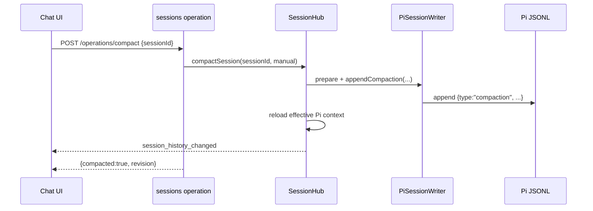
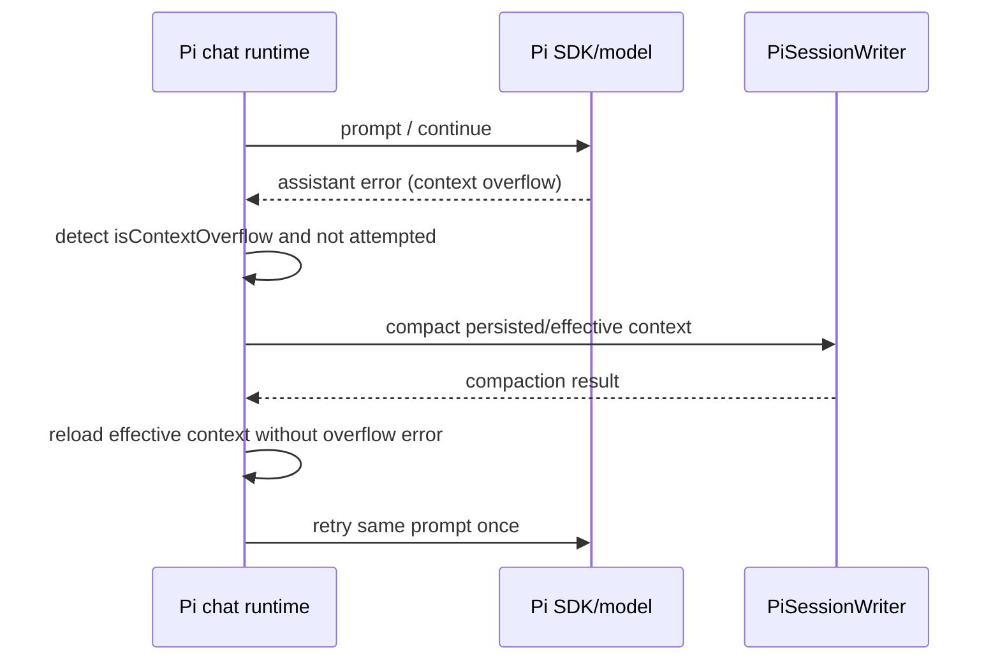

# Pi Session Compaction

## Overview

Add Pi-style context compaction for assistant's in-process `pi` provider sessions. Assistant already mirrors Pi SDK sessions to canonical Pi JSONL under `~/.pi/agent/sessions/...` and reloads Pi-backed state from that log; this feature extends that path so the log can contain Pi-compatible `compaction` entries, assistant can rebuild effective model context from them, users can trigger manual compaction from the chat request menu, and the server can automatically compact after threshold or context-overflow conditions. The compaction algorithm is vendored/adapted into assistant from pi-mono's coding-agent reference implementation rather than imported from `@mariozechner/pi-coding-agent` internals.

## Motivation

Long Pi-backed sessions can overflow while the agent is still working through tool calls. Pi mono mitigates this with threshold compaction and one-shot overflow recovery; assistant should mirror that behavior so unattended local Pi SDK sessions can continue instead of failing at the context limit.

## Scope

In scope:

- Add assistant-owned Pi compaction helpers adapted from pi-mono coding-agent's pure compaction logic.
- Add Pi JSONL `compaction` entry writing and effective-context replay in assistant's Pi session history layer.
- Add a manual **Compact Context** action to the existing request history menu in the chat UI.
- Add a sessions plugin HTTP/tool operation for manual compaction.
- Add per-agent Pi SDK compaction config with Pi mono-compatible defaults.
- Add threshold auto-compaction after completed Pi runs.
- Add defensive context-overflow detection that compacts and retries once.
- Keep Pi transcript projection compatible with existing `summary_message` display.

Out of scope:

- Changing `claude-cli`, `codex-cli`, or `pi-cli` compaction behavior.
- Importing or deep-importing `@mariozechner/pi-coding-agent` compaction modules directly.
- Adding extension hook support equivalent to Pi mono's `session_before_compact` / `session_compact` hooks.
- Adding a custom-instructions UI for manual compaction.
- Changing non-Pi event-store session persistence.

## Contract

### Configuration

Extend `PiSdkChatConfig` with an optional `compaction` object:

```ts
interface PiSdkChatConfig {
  // existing fields...
  compaction?: {
    enabled?: boolean; // default: true
    reserveTokens?: number; // default: 16384
    keepRecentTokens?: number; // default: 20000
  };
}
```

Validation rules:

- `enabled` is boolean.
- `reserveTokens` and `keepRecentTokens` are positive integers.
- Missing `compaction` uses `{ enabled: true, reserveTokens: 16384, keepRecentTokens: 20000 }`, matching pi-mono coding-agent defaults.
- These settings apply only to provider `pi`.

### Manual compaction operation

Add a sessions plugin operation and HTTP endpoint:

```http
POST /api/plugins/sessions/operations/compact
Content-Type: application/json

{
  "sessionId": "<session-id>"
}
```

Successful response:

```ts
type SessionCompactResponse = {
  sessionId: string;
  compacted: boolean;
  reason: 'manual';
  updatedAt: string;
  revision: number;
  result?: {
    summary: string;
    firstKeptEntryId: string;
    tokensBefore: number;
    details?: {
      readFiles: string[];
      modifiedFiles: string[];
    };
  };
};
```

Error behavior:

- `session_not_found` if the session does not exist.
- `invalid_arguments` if the session is not Pi-backed.
- `invalid_arguments` if `PiSessionWriter` is unavailable.
- `session_busy` if the session has an active chat run; manual compaction does not interrupt active runs.
- `invalid_arguments` with `Already compacted` or `Nothing to compact (session too small)` when no compaction entry can be produced.

### UI behavior

- Add **Compact Context** at the bottom of the existing request history menu, below **Reset Session**, only for provider `pi` sessions.
- The action opens a confirmation dialog:
  - Title: `Compact Context`
  - Message: `Summarize older Pi session history and keep recent context?`
  - Confirm text: `Compact`
  - Confirm style: primary.
- On confirm, call `POST /api/plugins/sessions/operations/compact`.
- On success with `compacted: true`, reload the session transcript just like `session_history_changed` handling does today.
- On failure, show the server-provided compact error when available, otherwise show `Failed to compact context`.

### Pi JSONL compaction entry

Append Pi-compatible compaction entries:

```ts
type PiSessionCompactionEntry = {
  type: 'compaction';
  id: string;
  parentId: string | null;
  timestamp: string;
  summary: string;
  firstKeptEntryId: string;
  tokensBefore: number;
  details?: {
    readFiles: string[];
    modifiedFiles: string[];
  };
  fromHook?: boolean;
};
```

After a compaction entry is written, assistant must bump the Pi transcript revision and broadcast `session_history_changed` so connected clients reload canonical replay.

### Effective context replay

When loading or syncing Pi-backed state from canonical Pi JSONL:

1. Walk the current linear parent chain.
2. Locate the latest `compaction` entry on that chain.
3. Build effective model context as:
   - a synthetic user message containing the compaction summary, using the Pi mono text wrapper:
     `The conversation history before this point was compacted into the following summary:\n\n<summary>...`
   - kept messages from `firstKeptEntryId` up to the compaction entry
   - messages after the compaction entry
4. Preserve assistant `piSdkMessage` objects and tool result linkage for kept messages.
5. Use the same effective context signatures in `PiSessionWriter.sync()` alignment so appending after compaction does not compare against discarded raw-history signatures.

### Auto threshold compaction

After a successful provider `pi` chat run:

1. Finish normal assistant response handling.
2. Persist final Pi assistant/tool messages with `PiSessionWriter.sync()`.
3. Persist the Pi turn end boundary.
4. Evaluate the final assistant message usage against compaction settings:
   - `contextTokens = usage.totalTokens || input + output + cacheRead + cacheWrite`
   - compact when `contextTokens > contextWindow - reserveTokens`
5. If over threshold, append a `compaction` entry with reason `threshold`, reload effective context into `state.chatMessages`, clear/update context usage as appropriate, and broadcast history change. The next Pi run rebuilds `piAgentRuntime.agent.state.messages` from canonical replay.
6. Do not retry or continue automatically for threshold compaction; it prepares the next run.

### Overflow recovery

When a Pi assistant message ends with `stopReason: 'error'`:

1. If `isContextOverflow(message, contextWindow)` is false, keep current error behavior.
2. If true and no overflow recovery was attempted for this outer run:
   - mark recovery attempted
   - remove the failed assistant error from active model context
   - compact current persisted/effective Pi context with reason `overflow`
   - reload effective context
   - retry the same prompt/request once
3. If the retry also overflows or compaction fails, surface an error equivalent to: `Context overflow recovery failed after one compact-and-retry attempt. Try reducing context or switching to a larger-context model.`
4. The overflow error assistant message should not be part of the retried model context.

## Surface Inventory

| Name                                               | Disposition                                               | Layers                                                                                                                                                                               | Symmetric peers                                                                          | Removal twin |
| -------------------------------------------------- | --------------------------------------------------------- | ------------------------------------------------------------------------------------------------------------------------------------------------------------------------------------ | ---------------------------------------------------------------------------------------- | ------------ |
| `Compact Context`                                  | Added                                                     | Chat request history menu, confirmation dialog, `SessionManager` client method, sessions plugin `compact` operation, `SessionHub.compactSession`, `PiSessionWriter.appendCompaction` | Existing `Delete Before`, `Delete Request`, `Delete After`, `Reset Session` menu actions | None         |
| `POST /api/plugins/sessions/operations/compact`    | Added                                                     | Sessions plugin manifest, plugin operation handler, generic plugin operation HTTP route, web client API call                                                                         | Existing `/api/plugins/sessions/operations/history-edit` and `/clear`                    | None         |
| `chat.config.compaction.enabled`                   | Added                                                     | Config schema, agent runtime compaction checks, docs                                                                                                                                 | Pi mono `CompactionSettings.enabled`                                                     | None         |
| `chat.config.compaction.reserveTokens`             | Added                                                     | Config schema, threshold check, docs                                                                                                                                                 | Pi mono `reserveTokens` default 16384                                                    | None         |
| `chat.config.compaction.keepRecentTokens`          | Added                                                     | Config schema, cut point selection, docs                                                                                                                                             | Pi mono `keepRecentTokens` default 20000                                                 | None         |
| Pi JSONL entry `type: "compaction"`                | Added for assistant writer, already understood by Pi mono | Pi session writer, replay parser, transcript projector, tests                                                                                                                        | Pi mono `SessionManager.appendCompaction()`                                              | None         |
| `summary_message` with `summaryType: "compaction"` | Existing/used                                             | Canonical Pi transcript projection and UI transcript rendering                                                                                                                       | Existing branch summary projection                                                       | None         |

## Schema

### Config schema

Before:

```ts
const PiSdkChatConfigSchema = z.object({
  provider: ...,
  apiKey: ...,
  baseUrl: ...,
  headers: ...,
  timeoutMs: ...,
  maxTokens: ...,
  contextWindow: ...,
  temperature: ...,
  maxToolIterations: ...,
});
```

After:

```ts
const PiSdkCompactionConfigSchema = z.object({
  enabled: z.boolean().optional(),
  reserveTokens: z.number().int().min(1).optional(),
  keepRecentTokens: z.number().int().min(1).optional(),
});

const PiSdkChatConfigSchema = z.object({
  // existing fields...
  compaction: PiSdkCompactionConfigSchema.optional(),
});
```

### Shared protocol / operation types

Add shared response typing for manual compaction if the project keeps session operation payloads in `@assistant/shared`:

```ts
export const SessionCompactResponseSchema = z.object({
  sessionId: z.string(),
  compacted: z.boolean(),
  reason: z.literal('manual'),
  updatedAt: z.string(),
  revision: z.number().int().nonnegative(),
  result: z
    .object({
      summary: z.string(),
      firstKeptEntryId: z.string(),
      tokensBefore: z.number().int().nonnegative(),
      details: z
        .object({
          readFiles: z.array(z.string()),
          modifiedFiles: z.array(z.string()),
        })
        .optional(),
    })
    .optional(),
});
```

### Pi JSONL schema

Assistant's internal Pi session entry union must add the `compaction` entry shape described in the Contract. Existing Pi transcript projection already treats `compaction` entries as `summary_message` events.

## Impact Surface

| File                                                      | Responsibility                                                                                                                                                                                                            | Existing tests                                                                                                              |
| --------------------------------------------------------- | ------------------------------------------------------------------------------------------------------------------------------------------------------------------------------------------------------------------------- | --------------------------------------------------------------------------------------------------------------------------- |
| `packages/agent-server/src/config.ts`                     | Parse `chat.config.compaction` under `PiSdkChatConfigSchema`; current Pi config includes `timeoutMs`, `maxTokens`, `contextWindow`, `temperature`, `maxToolIterations` at lines 213-222.                                  | `packages/agent-server/src/config.test.ts`                                                                                  |
| `packages/agent-server/src/agents.ts`                     | Add `compaction` to `PiSdkChatConfig`; current interface is lines 182-196.                                                                                                                                                | Config and lifecycle tests indirectly cover resolved agent definitions.                                                     |
| `packages/agent-server/src/contextUsage.ts`               | Reuse `calculateContextTokens()` and `buildSessionContextUsage()` logic; current usage calculation and percent are lines 4-44.                                                                                            | `packages/agent-server/src/contextUsage.test.ts`                                                                            |
| `packages/agent-server/src/history/piCompaction.ts` (new) | Vendored/adapted pure compaction logic: settings, token estimation, cut-point selection, summarization, file-op tracking.                                                                                                 | New unit tests mirroring pi-mono compaction cases.                                                                          |
| `packages/agent-server/src/history/piSessionWriter.ts`    | Add compaction entry type, `appendCompaction`, effective-signature loading, history rewrite compatibility; current entry union lacks compaction at lines 50-92 and sync alignment is lines 1472-1674.                     | `packages/agent-server/src/history/piSessionWriter.test.ts`                                                                 |
| `packages/agent-server/src/history/piSessionReplay.ts`    | Rebuild effective context from latest compaction instead of iterating only `message` entries; current replay loop only consumes `type: message` at lines 193-261.                                                         | `packages/agent-server/src/history/piSessionReplay.test.ts`                                                                 |
| `packages/agent-server/src/history/historyProvider.ts`    | Keep/verify transcript projection for `compaction`; existing code maps `compaction` to `summary_message` at lines 2123-2137.                                                                                              | `packages/agent-server/src/history/historyProvider` coverage via `chatEventUtils.test.ts` and sessions plugin replay tests. |
| `packages/agent-server/src/sessionHub.ts`                 | Add `compactSession`; enforce no active run for manual compaction; update state and broadcast history change like `editSessionHistory`; current Pi writer access is lines 166-212 and history edit flow is lines 610-680. | `packages/agent-server/src/sessionHub.test.ts`                                                                              |
| `packages/agent-server/src/chatRunCore.ts`                | Add overflow detection/retry around Pi agent prompt; current Pi branch creates the agent at lines 1285-1455 and throws upstream errors at lines 1799-1810.                                                                | `packages/agent-server/src/ws/chatRunLifecycle.pi.test.ts`                                                                  |
| `packages/agent-server/src/chatProcessor.ts`              | Trigger threshold auto-compaction after Pi sync/finalization; current final Pi sync is lines 818-833 and turn finalization is lines 840-848.                                                                              | `packages/agent-server/src/chatProcessor.test.ts`, Pi lifecycle tests.                                                      |
| `packages/agent-server/src/chatTurnFinalization.ts`       | No code change required; `chatProcessor.ts` calls `finalizeChatTurn()` before threshold compaction, so the compaction entry remains outside the just-finished request boundary.                                           | `packages/agent-server/src/ws/chatRunLifecycle.pi.test.ts`                                                                  |
| `packages/plugins/core/sessions/manifest.json`            | Add `compact` operation next to `clear` and `history-edit`; existing operations are listed around lines 213-247.                                                                                                          | `packages/plugins/core/sessions/server/index.test.ts`                                                                       |
| `packages/plugins/core/sessions/server/index.ts`          | Add `compact` operation handler returning `SessionCompactResponse`; current `history-edit` delegates to `SessionHub.editSessionHistory` at lines 700-728.                                                                 | `packages/plugins/core/sessions/server/index.test.ts`                                                                       |
| `packages/shared/src/protocol.ts`                         | Add optional `SessionCompactResponseSchema`; existing session history edit schemas are lines 585-607 and context usage schemas are lines 5-17.                                                                            | `packages/shared/src/protocol.test.ts`                                                                                      |
| `packages/web-client/src/index.ts`                        | Add menu item and confirmation dialog; existing request menu items are lines 3447-3493.                                                                                                                                   | Existing web-client tests are sparse; add targeted controller/utility tests if practical.                                   |
| `packages/web-client/src/controllers/sessionManager.ts`   | Add `compactSession(sessionId)` calling `sessionsOperationPath('compact')`; current history edit method is lines 131-152.                                                                                                 | Add unit coverage if a harness exists; otherwise cover via manual/browser smoke.                                            |
| `docs/CONFIG.md`                                          | Document `chat.config.compaction`; current Pi provider docs and Pi JSONL note are lines 619-663.                                                                                                                          | Documentation review.                                                                                                       |
| `docs/design/pi-sdk-provider.md`                          | Optional cross-link to this design; current history compatibility section describes Pi JSONL mirroring.                                                                                                                   | Documentation review.                                                                                                       |

## Higher-Level Implementation Steps

1. Add assistant-local Pi compaction modules adapted from pi-mono `packages/coding-agent/src/core/compaction`, preserving source comments and adding an adaptation note with the referenced pi-mono version.
2. Extend `PiSdkChatConfig` parsing, type definitions, and docs with compaction settings and Pi mono-compatible defaults.
3. Add compaction-aware Pi JSONL parsing utilities that return both raw entries and effective context, including synthetic compaction summary user messages.
4. Update `PiSessionWriter` to append `compaction` entries, reload effective signatures, and keep history rewrite/rechain behavior valid after compaction.
5. Add `SessionHub.compactSession()` for manual compaction, including Pi-backed validation, active-run guard, writer invocation, state reload, transcript revision bump, context usage update/clear, and `session_history_changed` broadcast.
6. Add sessions plugin `compact` operation and web-client `SessionManager.compactSession()` method.
7. Add **Compact Context** to the chat request history menu with confirmation and status handling.
8. Add threshold auto-compaction after successful Pi turn finalization and final Pi history sync.
9. Add one-shot overflow recovery in the Pi runtime path using `isContextOverflow`, compacting and retrying the same prompt once.
10. Add tests for config parsing, compaction preparation, Pi JSONL replay, writer alignment, manual operation, UI action path, threshold compaction, and overflow retry.

## Diagrams





## Risks

- **Replay mismatch after compaction:** `PiSessionWriter.sync()` currently aligns against every persisted message signature; after compaction it must align against effective context or future writes may be skipped as unreconcilable.
- **Visible transcript vs model context divergence:** transcript projection should show `summary_message`, while model context should receive a synthetic user summary message. These are related but not identical paths.
- **Request boundary ordering:** auto threshold compaction should append after `appendTurnEnd`, otherwise history edit spans and replay grouping could include compaction inside the just-finished request.
- **Overflow retry duplication:** retrying after an overflow must avoid duplicating user prompts, tool results, or partial assistant text in `state.chatMessages` and Pi JSONL.
- **Stale usage after compaction:** kept assistant messages may carry pre-compaction usage; threshold logic must ignore usage older than the latest compaction entry, mirroring Pi mono's stale-usage guard.
- **Concurrent manual compaction:** manual compaction must reject active runs, and writer operations must remain serialized through the existing write queue.
- **Default-on behavior:** enabling compaction by default mirrors Pi mono but changes runtime behavior for existing Pi SDK agents; documentation and config override are required.
- **Vendored code drift:** copied pi-mono logic can drift; include source provenance and focused tests rather than relying on package internals.

## Test Strategy

Implemented tests:

- `packages/agent-server/src/config.test.ts`: parses `chat.config.compaction`, defaults are applied by resolver/helper, invalid numbers are rejected.
- `packages/agent-server/src/history/piCompaction.test.ts`: covers the Pi threshold rule and previous-summary update behavior.
- `packages/agent-server/src/history/piSessionReplay.test.ts`: loads a Pi JSONL file with a `compaction` entry and verifies effective context is summary + kept messages + post-compaction messages.
- `packages/agent-server/src/chatProcessor.test.ts`: threshold auto-compaction delegates to `SessionHub.compactSession` after a completed Pi run, with `allowActiveRun: true` because the active run is cleared in the processor's `finally` block.
- `packages/agent-server/src/ws/chatRunLifecycle.pi.test.ts`: one-shot overflow compaction/retry when a Pi run returns a context-overflow error.
- `packages/plugins/core/sessions/server/index.test.ts`: `compact` operation delegates to `SessionHub.compactSession` and returns the expected response.
- `packages/shared/src/protocol.test.ts`: accepts any new compact response schema.

Follow-up coverage still worth adding:

- `packages/agent-server/src/history/piCompaction.test.ts`: token estimation edge cases, cut-point selection, split-turn summary preparation, and file-op details.
- `packages/agent-server/src/history/piSessionWriter.test.ts`: compaction entry append, effective signature reload, appending messages after compaction, and history rewrite compatibility.
- `packages/agent-server/src/sessionHub.test.ts`: non-Pi and active-session rejections, successful state reload, revision/context usage updates, and broadcasts.
- Web client unit coverage for `SessionManager.compactSession` error display if a controller harness is added.

Commands:

```bash
npm run build -w @assistant/shared
npm run build -w @assistant/agent-server
npm run build -w @assistant/web-client
npm test -- packages/agent-server/src/history/piCompaction.test.ts packages/agent-server/src/history/piSessionReplay.test.ts packages/agent-server/src/chatProcessor.test.ts packages/agent-server/src/ws/chatRunLifecycle.pi.test.ts packages/plugins/core/sessions/server/index.test.ts packages/shared/src/protocol.test.ts
npm run lint
npm run format
```

Manual checks:

- Start the server with a Pi SDK agent and low synthetic `contextWindow` / high reserve to force threshold compaction.
- Verify **Compact Context** appears at the bottom of the request history menu and causes a compaction summary to appear in replay.
- Verify a forced context overflow compacts and retries once without surfacing the first overflow error.

## Open Assumptions

- Manual compaction does not accept custom instructions in the first UI/API contract.
- Auto compaction is enabled by default for provider `pi`, matching Pi mono defaults, but can be disabled with `chat.config.compaction.enabled: false`.
- The feature targets in-process Pi SDK sessions only; `pi-cli` may display existing Pi CLI compaction entries but assistant will not initiate compaction for `pi-cli` sessions.
- The existing `session_history_changed` websocket message is sufficient for UI transcript reloads after compaction.
- The already-installed `@mariozechner/pi-coding-agent` dependency remains for local coding tools, but compaction code is vendored/adapted into assistant because the package exports only `.` and `./hooks` and does not expose the full preparation API needed here.
